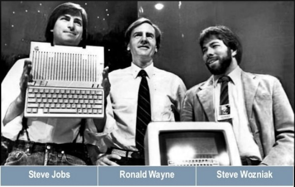

# Prime cose sull'Informatica

blah blah

## Prime parole

Cominciamo il corso dando importanza alle parole che solitamente
utilizzeremo, per essere sicuri che tutti capiscano perfettamente il
significato dei termini di uso comune. Se durante il corso troveremo
altri termini importanti da aggiungere in questo primo assaggio, lo
faremo :)

**Informatica**

Mi sembrava giusto iniziare da qui... L'**informatica **(neologismo che
deriva dalla fusione dei termini "*informazione*" e "*automatica*") è la
***scienza applicata*** che si occupa del trattamento dell'informazione
mediante procedure automatizzabili.

L'implementazione di queste procedure al giorno d'oggi coinvolge i
cosiddetti sistemi elettronici automatizzati detti quindi sistemi
informatici.

In altri termini è frequentemente descritta come lo studio sistematico
dei processi algoritmici che descrivono e trasformano l'informazione ed
è quindi punto di incontro di almeno due discipline autonome: il
progetto, la realizzazione e lo sviluppo di macchine rappresentatrici ed
elaboratrici di numeri (dunque l'elettronica) e i metodi di risoluzione
algoritmica di problemi dati (algoritmica), che sfruttino a pieno le
capacità di processamento offerte dalle macchine elaboratrici stesse per
l'ottenimento di determinati risultati in output a partire da
determinati dati di input.

La domanda principale che sostiene l'informatica è dunque: "Come si
può automatizzare efficientemente un determinato processo?".

**Hardware**

Nel linguaggio (inglese) comune, hardware indica genericamente un
manufatto di metallo. L'hardware shop è tipicamente una ferramenta.

In ingegneria, elettronica e informatica con il termine hardware si
indica la parte fisica di un personal computer, ovvero tutte quelle
parti elettroniche, meccaniche, magnetiche, ottiche che ne consentono il
funzionamento; più in generale il termine si riferisce a qualsiasi
componente fisico di una periferica o di una apparecchiatura
elettronica.

**Software**

In contrapposizione alla parola hardware è stato creato il neologismo
software, che rappresenta la parte logica (e quindi leggera, soft) che
compone il personal computer: sistema operativo, driver e applicazioni
in genere.

L'unione e la collaborazione di hardware e software è dunque la formula
che permette ai moderni dispositivi elettronici di funzionare.

**Sistema binario**

Il sistema binario è un sistema di numerazione posizionale a due cifre,
solitamente ZERO e UNO, che sta alla base della moderna informatica ed
elettronica, basata su tecnologie elettriche o magnetiche che ben si
schematizzano con la logica binaria (zero oppure uno, corrente oppure
no, accesso oppure spento, vero oppure falso, polo nord oppure polo
sud).

**bit**

Un bit, contrazione dell'inglese "***binary digit***", è una cifra
binaria che può essere dunque rappresentata con due singoli stati: lo
zero (0) oppure l'uno (1). E' l'informazione più piccola che si può
discernere e viene utilizzato solitamente, insieme ai suoi multipli, per
misurare la quantità di dati che si riesce a "spostare" nell'unità di
tempo.

**Byte**

Un byte, il cui nome deriva dalla parola inglese ***bite*** (boccone,
morso; coniato anche per assonanza col termine "bit" ma rinominato per
evitare confusioni accidentali di pronuncia con questo), è una sequenza
di 8 bit diversi, da cui si deduce che sia in grado di assumere 2^8^ =
256 possibili valori (da 0 a 255).

La scelta degli 8 bit per identificare un byte ha radici storiche:
servono ad esempio circa 200 livelli di grigio per passare dal bianco al
nero perché l'occhio umano pensi di vedere una sfumatura continua,
servono circa 200 caratteri diversi (lettere accentate comprese) per
scrivere un qualsiasi testo di una lingua occidentale, servono circa 200
livelli di intensità per riprodurre un suono abbastanza fedele.

Il byte è la quantità di memoria necessaria per codificare un "singolo
carattere di testo" in un computer, ed è perciò divenuto l'elemento
base nell'indirizzamento nelle architetture dei computer e viene
considerato come l'**unità di misura dell'informazione**.

**Multipli del byte**

I multipli del byte vengono calcolati con una logica binaria, quindi ad
esempio il kilobyte non rappresenta 1000, bensì 2^10^ byte! Se
consideriamo però che 2^10^ = 1024, con una piccola approssimazione
riusciamo a capire le grandezze dei suoi multipli.

Vediamo la tabella:

|            |    |          |                                       |
|------------|----|----------|---------------------------------------|
| kilobyte   | KB | 2^10^ B  | Circa 1000 byte                       |
| megabyte   | MB | 2^20^ B  | Circa 1000 KB, circa 1.000.000 byte   |
| gigabyte   | GB | 2^30^ B  | Circa 1000 MB...                      |
| terabyte   | TB | 2^40^ B  | Circa 1000 GB...                      |
| petabyte   | PB | 2^50^ B  | ...                                   |
| exabyte    | EB | 2^60^ B  | ...                                   |
| zettabyte  | ZB | 2^70^ B  | ...                                   |

## Breve storia dell'informatica

Se abbiamo capito che l'informatica è la scienza che studia
l'automazione dell'elaborazione e della trasmissione delle informazioni
sarà facile dedurre come i primi strumenti informatici (gli "antenati"
dei computer) non siano altro che calcolatori...

**L'abaco (1200 A.C)**

E' lo strumento più antico di calcolo di cui si conosca traccia. I primi
esemplari risalgono al 1200 A.C. in Cina e Mesopotamia.
(<https://it.wikipedia.org/wiki/Abaco>). Usato anche da greci e romani.
E alle elementari...

**I numeri arabi e la scienza islamica (800 D.C.)**

La matematica fa un passo avanti decisivo nell'automatizzazione dei
processi di calcolo quando introduce ***un sistema di numerazione
posizionale***!!!

Passare dai numeri romani: I , II , III , IV , V . . .

ai numeri cinesi: 一 二 三 四 五 . . .

che rappresentano delle quantità iterative (come si dice 5 in romano?
50? 500? 500.000? )

ai numeri arabi: 1 , 2 , 3 , 4 , 5 . . .

con il loro significato posizionale (cioè 15 significa 1 decina e 5
unità) è un passo in avanti clamoroso per i calcoli!

Non so se ci avevate pensato mai, ma... prima non si potevano fare le
operazioni in colonna! Se adesso sì, è merito dei numeri arabi e del
loro sistema posizionale!!!

Tutto il merito della creazione di un siffatto sistema la si deve
all'invenzione... dello ZERO! Eh sì... romani e cinesi NON avevano lo
ZERO. Esso è stato introdotto da quello che consideriamo ***il primo
informatico della storia***: il geniale algebrista ***Al-Khwarizmi***,
che intorno all'anno 800 DC descrive anche un procedimento logico per
risolvere i problemi. Quando in informatica troviamo una soluzione ad un
problema, cerchiamo infatti di descriverla tramite un ***algoritmo***,
parola che deriva dal suo nome.

**Calcolatori meccanici (1600-1800)**

***La Pascalina*** è il nome della prima calcolatrice meccanica, che deve il nome al suo inventore, il matematica, fisico e filosofo francese ***Blaise Pascal***, che nel 1643 realizzò una macchina in grado di fare meccanicamente addizioni e sottrazioni.

***Charles Babbage***, matematico inglese, costruì nel 1834 il primo
calcolatore digitale automatico di uso generale (addizioni, sottrazioni,
divisioni, moltiplicazioni e altre operazioni), che chiamò ***macchina
analitica*** e costituì un modello per tutti i successivi calcolatori
digitali.

!!! note "Curiosità 1"

    Vista l'imponenza degli ingranaggi che aveva progettato, 
    Babbage decise di utilizzare un telaio da sartoria per la
    struttura portante della macchina.

    Inoltre il suo progetto comprende il primo esempio di "scheda
    perforata", ovvero il primo esempio di codice memorizzato in un hard
    disk.

!!! note "Curiosità 2"

    L'assistente di Babbage, ***Ada Lovelace*** è diventata anche più famosa
    di lui nella storia dell'informatica. Avendo creato un sistema teorico
    per la programmazione della macchina analitica, viene considerata ***la
    prima programmatrice della storia*** (NON il primo programmatore donna,
    la prima in assoluto!!!). In suo onore nel 1979 è stato inventato il
    linguaggio di programmazione ADA!

**I primi calcolatori elettronici (1900)**

Il ventesimo secolo, le guerre mondiali e il grande sviluppo della
tecnologia sono elementi che danno un grande impulso alle tecnologie
utilizzate in informatica.

Vale la pena di ricordare a questo proposito il risultato incredibile
del giapponese ***Akira Nakajima***, un ingegnere della NEC che negli
anni Trenta intuisce il ***legame fra l'algebra booleana ***(la teoria
del vero/falso) ***e la logica dei circuiti elettronici***: nasce così
la possibilità di progettare circuiti elettronici in grado di risolvere
operazioni logiche.

Nel 1924 nasce IBM, la prima azienda a fare dell'informatica il suo core
business, che darà una forte spinta alla progettazione di hardware "in
miniatura" (i computer del 1930 erano grandi come una casa! Circa 6
stanze...).

Ancora una volta però i contributi determinanti arrivano dal mondo delle
idee...

**La macchina di Turing (1936)**

Alan Turing è un famoso matematico inglese fissato con le mele che il
governo inglese assume per decriptare i messaggi cifrati dall'esercito
tedesco con la celebre macchina ENIGMA.

Per riuscire in questo intento implementa nel calcolatore
"***Colossus***", costruito nel 1943, i dettami dello strumento teorico
da lui stesso concepito qualche anno prima: **La Macchina di Turing
(1936)**!

La MdT è una macchina ideale che è in grado di manipolare dati presenti
in un ipotetico nastro infinito, alterandoli secondo un insieme
prefissato di regole prestabilite, per raggiungere uno scopo.

**L'architettura di Von Neumann (1945)**

Fino a questo traguardo della scienza umana i computer
non erano altro che "calcolatrici molto veloci". Certo, potevi decidere
che tipo di operazione fare, potevi fare un sacco di operazioni a
velocità incredibili (per l'epoca), ma niente che avvicinasse quei
mastodonti a ciò che noi oggi chiamiamo ***computer***.

Fino a questa idea.

L'idea è quella di progettare un dispositivo generico in grado di
eseguire potenzialmente qualunque operazione. L'hardware gli permetterà
di ragionare, mentre le istruzioni per farlo dovranno venire dal
software! L'architettura di Von Neumann descrive come dovrebbe essere
fatto questo hardware. Non è una "architettura" in senso stretto, è un
progetto da implementare.

Nasce il computer moderno, come lo conosciamo noi.

Dopo la creazione del modello di Von Neumann si comprende come la
Macchina di Turing sia l'anello mancante che permette di automatizzare
l'esecuzione degli algoritmi! Ecco l'idea su cui si basa
l'implementazione delle moderne CPU!

Tutti i dispositivi informatici di oggi (computer, notebook, smartphone,
tablet, etc...) sono implementazioni dell'architettura di Von Neumann
ed eseguono programmi come implementazioni di una Macchina di Turing!

**Dennis Ritchie, Kevin Thompson, il linguaggio C, UNIX (1960-1975)**

Negli anni '60 le aziende che più di tutte utilizzavano
l'informatica erano le aziende telefoniche, in particolare il colosso
americano AT&T. Nei suoi laboratori di ricerca, i ***Bell
Laboratories***, succedono le cose più interessanti per la storia
informatica del periodo.

Lì, ***Kevin Thompson*** progetta il sistema operativo UNIX, che dovrà
gestire tutto il traffico telefonico dei centralini d'America.

In quegli stessi laboratori il suo collega ***Dennis Ritchie*** sviluppa
il ***linguaggio C*** (terzo tentativo dopo i linguaggi... capito no?),
un linguaggio procedurale altamente performante.

Quando i due iniziano a collaborare, UNIX viene completamente riscritto
in linguaggio C, diventando un sistema operativo multiutente e
multiprocesso, con supporto al networking e quindi allo scambio di
informazioni fra 2 sistemi UNIX.

UNIX è l'antenato di tutti i sistemi operativi moderni (Linux, Android,
MacOS, iOS, BSD: praticamente tutti tranne Windows), il cui corpo
centrale viene ancora oggi scritto in linguaggio C...

A metà degli anni 70 Il dipartimento della difesa americano commissiona
ai laboratori Bell, dove Thompson e Ritchie lavoravano, la creazione di
una rete di collegamento fra i centri strategici militari in grado di
scambiare velocemente informazioni anche in caso di attacco armato:
nasce la rete ***ARPAnet***, l'antenata di Internet.

**Apple, Microsoft e la rivoluzione dell'home computer (1976 in avanti)**

Nel 1976 nasce Andrea Diamantini.

In quello stesso anno ***Steve Jobs***, Steve Wozniak e
Ronald Wayne fondano la ***Apple Computers***.

Nel garage di casa Jobs, questa "startup" inizia la sua guerra
personale contro il colosso del tempo: la IBM, iniziando su piccolissima
scala la produzione di computer destinati agli hobbisti e non più ad
aziende e lavoratori.

Giusto un anno prima viene fondata la ***Microsoft***
ad opera di ***Bill Gates*** e Paul Allen. Pur con un anno di anticipo
rispetto alla Apple, questa azienda che si focalizza unicamente sulla
produzione di software ha bisogno di più di 10 anni di lavoro per
affermarsi al grande pubblico e dell'impulso al mercato che la Apple
introduce, ma che Microsoft sfrutta al meglio.

Queste aziende e i loro leader carismatici caratterizzeranno la storia
dell'informatica (e non solo) degli anni a venire. Il loro successo sta
nel fatto di essere riusciti a portare l'informatica nelle case di tutte
le persone!

P[]{#anchor-1}rima di Steve Jobs e Bill Gates l'informatica era una
scienza settoriale a cui si dedicavano solo aziende specializzate. Con
la loro discesa in campo l'informatica diventa uno strumento alla
portata di tutti.

**L'era di Internet (1989, oggi)**

Negli anni ottanta negli Stati Uniti si termina lo sviluppo della rete
ARPANET, pubblicando le specifiche della suite di protocolli **TCP/IP**,
che segnano l'inizio dell'era di Internet.

Nel 1989, al CERN di Ginevra, il fisico ***Tim Berners Lee*** inventa
uno strumento per diffondere in tempo reale informazioni e articoli
scientifici: nasce il **World Wide Web**, basato sul protocollo HTTP, lo
schema URL e il linguaggio HTML.

Nel 1994 esce il primo browser a diffusione mondiale: Netscape
Navigator. L'anno dopo Microsoft risponde con il sistema operativo
Windows 95 con incluso il browser Internet Explorer. In questo modo gli
utenti Windows sono "guidati" ad usare Il browser Microsoft invece che
installare Netscape, che perde importanti quote di mercato. Undici anni
dopo Microsoft perderà il processo per concorrenza sleale, quando ormai
Netscape era fallita... era iniziata la [***guerra dei
browser***](https://it.wikipedia.org/wiki/Guerra_dei_browser)!

L'egemonia di Internet Explorer sarà spezzata anni dopo dal browser Mozilla Firefox.

Nel 1991 lo studente finlandese ***Linus Torvalds***
progetta il kernel per il sistema operativo libero e aperto
[***GNU/LINUX***](https://it.wikipedia.org/wiki/Linux).

Il suo progetto sarà talmente innovativo che diventerà il kernel di
sistemi che vanno dal piccolo smartphone con sistema operativo Android,
ai server dei maggiori servizi della rete Internet, fino ad arrivare a
(tutti i) [Top500 supercomputers](https://www.top500.org/).

Sì... tutti i 500 computer più potenti del mondo funzionano con kernel Linux.

Nel 2017 ho iniziato a scrivere queste righe per voi. Spero vi siano piaciute.
