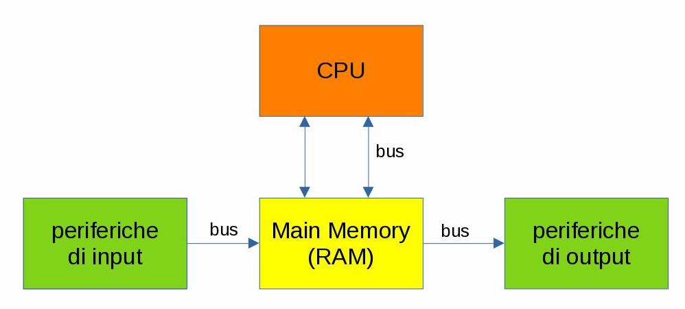
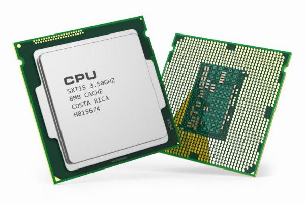

# Hardware

Nella nostra piccola disamina sulla storia dell'informatica abbiamo già detto come 
oggigiorno ci si riferisca comunemente al computer come ad un
dispositivo elettronico e digitale, programmabile e a scopo generico,
costruito secondo la cosiddetta `Architettura di Von Neumann` e
funzionante secondo la logica indotta dalla `Macchina di Turing`.

Ovviamente l'implementazione fisica di questi concetti è progredita enormemente col passare del tempo.
Quello che non è ancora cambiato è la base di partenza del processo di progettazione dei dispositivi.

## Architettura di Von Neumann

L'architettura di Von Neumann, basata sul suo famoso modello, è uno
schema di progettazione di calcolatori elettronici che prende nome dal
matematico John von Neumann e che fu sviluppato per il sistema IAS
machine dell'Institute for Advanced Study nella metà degli anni 40.

 

Lo schema si basa su cinque componenti fondamentali:

1) La **CPU**: Central Processing Unit. Il "cervello" operativo della macchina.

2) La **Main Memory**: La memoria principale, utilizzata come memoria di lavoro.

3) Il **Bus**. Un canale che collega tutti i componenti fra loro.

4) Le **Periferiche di Input**: Servono per l'inserimento utente dei dati da eleborare.

5) Le **Periferiche di Output**: Servono per visualizzare all'utente i risultati delle elaborazioni.

 

L'idea dietro alla architettura di Von
Neumann è semplicemente quella di descrivere il flusso dei dati a
partire dal momento in cui sono immessi, al momento in cui questi sono
elaborati, fino al momento in cui questa elaborazione viene restituita
in output all'utente.

**CPU**

La Central Processing Unit, il componente principale del computer, è
l'implementazione della Macchina di Turing. 
Il *nastro infinito* per le sue elaborazioni prende informazioni e scrive risultati
sulla memoria centrale: tutte le interazioni della CPU sono solo e verso 
la memoria centrale.

**La Main Memory**

La memoria centrale rappresenta il collegamento della CPU con il resto
del mondo. È una memoria di tipo **RAM** che funziona secondo principi
elettrici: le sue uniche capacità sono quelle di leggere, ovvero di
copiare qualcosa dall'esterno su di essa, e di scrivere, ovvero di
copiare una parte di se stessa da qualche parte.

!!! tip "il resto del mondo (dell'hardware)"

    Con i due attori principali fatti a questo modo... come si fa a gestire tutte le funzionalità che vediamo
    mostrare un computer?
    
    Beh... *il trucco è far credere a CPU e Main Memory che tutto sia un file!!!*  
    Vuoi scrivere sullo schermo? Scrivi su questo file qui.  
    Vuoi sapere cosa ho digitato sulla tastiera? Leggi quel file.  
    Vuoi stampare? Scrivi su quest'altro file.  
    Vuoi vedere cosa mi sta arrivando dalla Rete? Leggi quell'altro file ancora...

**Le periferiche**

Le periferiche di Input/Output fanno esattamente questo: implementano
una funzionalità dal punto di vista fisico (ad esempio "stampano" o
"visualizzano luci") e interagiscono con il computer secondo la logica
descritta prima.

**Il Bus**

Il nome che è stato scelto da proprio l'idea del trasporto... solo che questo
bus non trasporta le persone, ma i dati, i comandi e le informazioni!!!

## La CPU

{style="width:50%; float:right; margin-left:20px"}

L'unità centrale di elaborazione (CPU) è la parte di un computer che
esegue le istruzioni di un programma per computer, per eseguire le
operazioni aritmetiche di base, logico, e di input / output del sistema.

Dal 1970 ad oggi, sempre migliorando le dimensioni e le prestazioni totali delle stesse, 
le CPU sono state implementate come *microprocessori digitali basati su un'architettura a registri generali*.

La CPU è un *microprocessore general purpose* in grado di eseguire un set limitato di istruzioni
chiamato **Linguaggio Macchina**.

Per semplificare i paradigmi di costruzione, le parole che una CPU è in grado di leggere hanno lunghezza fissa:
questa lunghezza caratterizza di fatto l'intera CPU!!! Esempi di lunghezza di **parola** sono 8 bit, 16 bit, 32 bit, 64 bit.

La CPU è in grado di eseguire ognuna delle istruzioni appartenenti al suo set di base, leggendo l'istruzione, caricando eventuali dati
di input, facendo l'elaborazione richiesta e scrivendo in output il risultato della sua elaborazione. A questo punto la CPU è pronta a leggere
la prossima istruzione... e cosi via dal momento che viene accesa fino al momento dello spegnimento!

Questa ripetizione continua viene definita **ciclo del processore**. Il numero di cicli che una CPU è in grado di eseguire in un secondo
viene definita la **frequenza** di una CPU e si calcola in Hz (più probabilmente con un suo multiplo: MHz o GHz).

!!! warning "Completa le conoscenze"

    * Che cosa è un (micro)processore? 
    * Che differenza c'è fra un (micro)processore e un (micro)controllore?
    * Come si determinano le prestazioni di una CPU? Come si calcola la sua velocità?
    * Cosa significa fare un *benchmark* della tua CPU??? Come è possibile farlo?
    * Quali sono le CPU attualmente in commercio? Quanto costano?
    * Architetture per la CPU: x86 vs ARM
    * CPU per i computer fissi, per i portatili, per i tablet, per gli smartphone
    * Quali sono le aziende che producono CPU? Dove si trovano? Quali tipologie di processori producono?
    

## Le memorie

Le memorie sono la parte del computer destinata a conservare informazioni per un certo periodo di tempo. 

In questa breve disamina, prima proveremo ad evidenziare tutte le caratteristiche principali che dovremmo conoscere
sulle memorie, poi andremo a *studiare* un pò i tipi di memoria più comuni, osservandoli anche alla luce delle nuove
conoscenze acquisite.

Iniziamo!

Le memorie possono essere classificate secondo vari criteri:

 

-   *Volatilità*
    
    1) le ***memorie volatili*** perdono Tipicamente tutte le completamente le informazioni in esse contenute non appena si interrompe l'alimentazione elettrica.
    
    2) le ***memorie permanenti*** mantengono le informazioni anche senza essere alimentate da corrente elettrica.

 

-   *Tipo di accesso*

    Secondo questa classificazione ritroviamo tre tipi di memorie: 
    
    1) le ***memorie ad accesso sequenziale*** possono essere lette e scritte solamente all'indirizzo immediatamente successivo 
       all'indirizzo a cui è avvenuto l'accesso precedente. I principali esempi di memorie ad accesso sequenziale sono i nastri magnetici.

    2) Le ***memorie ad accesso casuale*** possono essere lette e scritte a  qualunque indirizzo, ma con lo stesso tempo di accesso.

    3) le ***memorie ad accesso semi-casuale*** sono organizzate come le memorie ad accesso casuale, ma non per qualunque indirizzo in
       memoria: infatti i "blocchi" casuali sono molto grandi e al loro interno le informazioni vengono accedute sequenzialmente.

 

-   *Possibilità di scrittura*

    1) ***memorie a lettura-scrittura***: possono essere sia lette che scritte.
    
    2) ***memorie a sola lettura*** (ROM: Read Only Memory)
    
    3) ***memorie WORM*** (Write Once, Read Many): memorie che possono essere scritte una sola volta e poi diventano in sola lettura.

 

-   *Tecnologia di costruzione*

    Attualmente i principi di costruzione attualmente in uso si basano sulle seguenti tecnologie:
    
    - **Elettriche**: si basano sulle capacità elettriche ed elettroniche di alcuni componenti come condensatori e semiconduttori.

    - **Magnetica**: si basano sulle capacità magnetiche di alcuni materiali.

    - **Ottica**: si basano su principi ottici e di riflessione/rifrazione della luce per memorizzare le informazioni.

### Memorie RAM

{style="width:50%; float:left; margin-right:20px"}

Acronimo per "random access memory", ovvero "memoria ad accesso casuale", 
è la memoria in cui vengono caricati i dati che devono essere utilizzati dal calcolatore per elaborare.

La RAM è il tipico esempio di memoria volatile (si cancella spontaneamente ed ha bisogno di essere aggiornata continuamente): 
ovviamente il principio di costruzione di una memoria volatile è quello elettico.

Le RAM sono le tipiche memorie che implementano la **Main Memory** e sono quindi le memorie di primo utilizzo da parte della CPU.

### Memorie ROM

Acronimo per "read only memory", ovvero "memoria in sola lettura" (o solamente leggibile), 
è una memoria permanente (cioè ha un contenuto fisso che non può essere cancellato; ovviamente non è una memoria
volatile), presente sulla scheda madre, che contiene le istruzioni che la CPU deve caricare per consentire l'avvio del sistema e le routine di
gestione dell'hardware che prendono il nome di BIOS (Basic I/O System).

### Dischi magnetici

{style="width:50%; float:right; margin-left:20px"}

Composti da uno o più dischi (i disk pack) ricoperti di materiale ferromagnetico, vengono "letti e scritti" 
(cioè su questi dischi vengono salvati e recuperati i dati) mediante un braccio mobile dotato
della "testina di lettura/scrittura". 

I dati vengono trasferiti ai dischi magnetici tramite un buffer nella memoria centrale ed occupano
successive posizioni lungo le tracce, sotto forma di differenti stati di magnetizzazione. 

I settori dei dischi vengono letti e scritti interamente utilizzando il numero della superficie, della traccia e del
settore. Il tempo di accesso ai dischi magnetici è superiore rispetto a
quello della memoria centrale, ma i costi, a parità di quantità di
informazione memorizzata, sono decisamente più bassi. 

!!! warning "E... le altre memorie?"

    Esistono tanti altri tipi di memorie: le penne USB, le memorie flash, i dischi SSD, etc...
    
    Come si fa a studiarli tutti???
    

!!! note "La formattazione delle memorie"

    Per poter utilizzare una memoria, occorre formattarla. Ma... cosa 
    significa questa cosa? Che cosa fa esattamente questa operazione?
    
    Documentiamoci dai...

## Le periferiche

!!! note "Ricerche di Gruppo"

    Temi delle ricerche:
    
    - Monitor: tipologie di schermi CRT, Plasma, LCD, LED. Periferiche touch
    - Tastiere: tipologie e connettori. Schemi alfanumerici. Tavolette grafiche
    - Mouse: tipologie e connettori. Touchpad, trackball.
    - Scheda madre: l'implementazione del BUS.
    - Audio: microfoni, cuffie, auricolari
    - Riproduzione: stampanti, scanner, multifunzione.
    - Memorie speciali: RAM, ROM
    - Memorie permanenti: HD, SSD, schede SD, penne USB
    - Memorie: CD, DVD, Blu-Ray.

