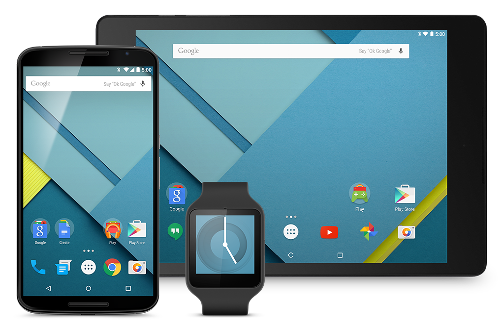

# Il software

Software e' un termine generico che definisce programmi e procedure
utilizzati per far eseguire ad un dispositivo elettronico un determinato
compito. Il termine è un neologismo del ventesimo secolo inventato in
contrapposizione al termine "hardware", dunque un componente (-ware)
"soft", mordibo, leggero.

I primi "software" possono essere datati 1941, quando il sistema di
controspionaggio inglese, capitanato da Alan Turing, lavorava alla
decriptazione dei messaggi inviati dall'esercito tedesco con la macchina
Enigma. Le istruzioni di decriptazione erano scritti su carta solubile,
in modo da poter essere distrutti semplicemente in pochi secondi
("software").

Nel mondo di oggi, una moltitudine di oggetti viene controllata da esso:
computer, tablet, smartphones, automobili, TV, lavatrici ed elettrodomestici in genere.

È possibile classificare il software in due grandi macro-aree:

-   **software di base**, indispensabile al funzionamento del computer.
    È ciò che fa la differenza fra avere una scatola di ferro e plastica
    fra le mani e quello che noi chiamiamo "computer". Viene solitamente
    identificato con il sistema operativo;

-   **software applicativo**. Comprende i programmi che il programmatore
    realizza utilizzando le possibilità che il sistema operativo offre.
    Tutti i programmi che solitamente utilizziamo fanno parte di questa
    categoria.

## I sistemi operativi

{style="float:left;margin-right:20px"}

I sistemi operativi (spesso abbreviato con OS) sono un insieme di
applicazioni di base (vedi sopra) che da un lato si occupano di gestire
l'hardware su cui sono installati, dall'altro rendono disponibili ai
software applicativi le risorse di cui hanno bisogno per eseguire le
proprie operazioni.

I sistemi operativi sono installati su tutti i dispositivi elettronici avanzati (PC desktop, notebook, tablet,
smartphones, console per videogiochi, lettore mp3...) e sono dunque
grossolanamente classificabili in base al dispositivo a cui sono
rivolti.

Vediamo una carrellata dei sistemi operativi più famosi: per piattaforma
desktop, troviamo la famiglia di sistemi operativi ***Microsoft Windows***, oppure il sistema operativi ***Mac OS di Apple*** e le
innumerevoli distribuzioni ***GNU/Linux***.

Per dispositivi mobili, dominano la scena i sistemi operativi
***Android***, della "*Open Handset Alliance*" capitanata da Google e
***iOS*** di Apple.

!!! tip "Domanda"

    Quanti sistemi operativi conosci? Quanti ne esisteranno secondo te?
    Proviamo a cercare su Internet informazioni sui sistemi operativi. Ci
    interessa sapere:

    - il loro nome
    - che simbolo hanno
    - se sono per desktop, mobile o dispositivi particolari
    - vedere uno screenshot di come sono fatti

    Proviamo a fare una piccola ricerca su Internet e a riempire un foglio
    di Libreoffice Writer con queste informazioni. Dieci minuti di tempo...

Vediamo qui di seguito una carrellata dei sistemi operativi più
conosciuti, almeno ad oggi (Settembre 2017).

### Windows 10

Windows 10 è il decimo OS prodotto da Microsoft e a sentire le loro dichiarazioni, 
doveva anche essere l'ultimo...

Nella strategia di Microsoft, questo doveva essere il sistema operativo
in cui far convergere tutti i dispositivi: desktop, tablet, smartphone,
console.

Invece...

### Mac OS

MacOS è il nome dato al sistema operativo desktop prodotto da Apple.

Sebbene Apple sia una delle aziende pioniere della storia
dell'informatica, questo OS è stato riscritto da zero solo nel 2001,
abbracciando una derivata UNIX-like della famiglia BSD e mantenendo
l'aspetto grafico originario.

Una delle caratteristiche principali di macOS è che è progettato
specificatamente per l'hardware dei (pochi) dispositivi che Apple
produce.

### Distribuzioni GNU/Linux

Una distribuzione Linux è una raccolta di software
tipicamente libero e opensource basata sul kernel GNU/Linux e l'X Window
System.

In generale una distribuzione Linux rappresenta un sistema operativo
UNIX-like, formato tramite la raccolta e la libera distribuzione di
software libero selezionato.

Ma chi fa questa selezione? Chi distribuisce questa raccolta di
software?

Esistono tipicamente due categorie di distribuzioni: quelle implementate
da aziende, quali Red Hat, Novell, Mandriva, Canonical... che realizzano
la loro distribuzione per uno scopo ben preciso oppure quelle divulgate
da comunità libere di hobbisti, quali Debian, Slackware, Gentoo, etc...

### Sistemi BSD

I sistemi operativi della Berkeley Software Distribution sono una
variante originale del sistema UNIX sviluppata (indovina un po'...)
presso l'università di Berkeley della California.

Il sistema operativo BSD non è più utilizzato e sviluppato, ma da esso è
partita una famiglia di sistemi operativi liberi molto diffusi,
soprattutto in ambito mainframe e network management, fra cui vale la
pena ricordare:

- [FreeBSD](https://www.freebsd.org/), su cui si basa il
  firewall/proxy del liceo
- [FreeNAS](http://www.freenas.org/), utilizzato su dispositivi di
  archiviazione di rete
- [DarwinOS](http://www.puredarwin.org/), sistema libero sovvenzionato
  da Apple, su cui si basa Mac OS
- [Orbis OS](https://www.playstation.com/en-gb/get-help/ps4-system-software/),
  il sistema operativo della PlayStation

Valeva la pena citarli, vero??

PS: L'ho detto che anche il servizio [Netflix](https://openconnect.netflix.com/en/appliances/#software) si
basa su FreeBSD? E che anche i server [Whatsapp](https://freebsdfoundation.org/testimonial/whatsapp/) lo
stesso?

### Android

Android è un sistema operativo per dispositivi mobili
derivato da Linux (praticamente è come un'altra distribuzione Linux) e
sviluppato principalmente da Google e da tutta la [Open Handset
Alliance](https://it.wikipedia.org/wiki/Open_Handset_Alliance).

Originariamente progettato per smartphone e tablet, possiede interfacce
utente specializzate per vari devices quali automobili (Google Auto),
occhiali (Google Glass), orologi da polso (Android Wear) e TV (Android
TV).

Ad oggi (Settembre 2017) Android è il sistema operativo mobile più
diffuso al mondo con oltre il 60% del mercato.

### iOS

iOS è un sistema operativo sviluppato da Apple per i
dispositivi che lei stessa produce: iphone, ipad, ipod.

Come macOS, è un sistema operativo derivato da DarwinOS, ma ridisegnato
per adeguarlo ai particolari dispositivi che andrà a gestire.

Questa caratterizzazione, soprattutto nelle librerie grafiche, rende le
applicazioni per i due OS prodotti da Apple incompatibili fra di loro.

A settembre 2017 iOS ha superato il 30% di presenza nel mercato mobile
mondiale.

!!! note "Lavoro di gruppo sui Sistemi Operativi"

    Il prof ha una proposta per voi...

## Compiti di un OS

Un sistema operativo è un insieme di software di base che realizza i
compiti di gestione del dispositivo e dell'interfacciamento utente.

In particolare esso si occupa:

-   della gestione dell'***hardware*** di cui è composto il dispositivo;
-   dell'esecuzione dei ***programmi***, con particolare attenzione alla
    distribuzione delle ***risorse*** (CPU e memoria di base) ai
    ***processi*** che ne richiedono l'utilizzo;
-   alla gestione dell'***interfaccia utente***, in modo che
    quest'ultimo possa impartire al sistema i suoi comandi e
    visualizzare ciò che ne consegue;
-   alla gestione del ***file system***, tramite il quale i dati possono
    essere memorizzati e acceduti dal sistema.

Mi rendo conto che questa descrizione è un po' stringata e "criptica".
Provo a spiegare quali sono i compiti principali di un OS, partendo
dalle parole chiave che trovate sottolineate nel testo.

---

**Hardware**

Se siete arrivati a leggere fino a qua, cosa è l'hardware dovreste già
saperlo... passiamo veloci alla prossima definizione.

---

**Programmi e Processi**

Programma è sinonimo di software, ovvero un file memorizzato nel
filesystem che è eseguibile direttamente dal sistema operativo. Per
questo motivo i programmi vengono detti anche "eseguibili" e su Windows
sono i file con estensione ".exe".

I processi sono i programmi attualmente in esecuzione. Proviamo a
spiegare la differenza con un esempio: sul mio computer ho installato
una copia di MS Word, che è ovviamente un programma. Se clicco su 2 file
.doc e si aprono 2 finestre di Word per visualizzare e modificare questi
file, avrò in esecuzione 2 processi dello stesso programma. Il programma
è uno (MS Word), ma i processi per questo esempio sono 2. Ovviamente le
risorse (CPU e memoria di base) vanno ai processi, NON ai programmi!

---

**Risorse**

Una risorsa è un componente fisico o virtuale che offre una determinata
funzionalità e di cui si ha una disponibilità limitata.

Nei nostri esempi, le risorse sono le memorie di base, che purtroppo
sono sempre limitate e la CPU che è tipicamente una!!!

Le risorse vanno distribuite fra tutti i processi che le richiedono: più
OS realizza bene questo compito e più il sistema appare "scattante" e
"responsivo". Chiaro?

---

**File system**

Un file system è un meccanismo di organizzazione dei dati che
costituiscono i file all'interno dei dispositivi di archiviazione (le
memorie di massa). Tramite il filesystem diventano possibili tutte le
operazioni sui file, quali lettura, scrittura, modifica, organizzazione
gerarchica, navigazione e accesso.

Capite bene che un sistema operativo che non gestisca un filesystem è
incredibilmente limitato nelle sue funzionalità.

Spiegati i termini, spero sia più facile capire quelli che sono i
compiti di base di un OS. Allora vi chiedo... tornate su e
rileggeteli!!!

Poi andiamo avanti.

## Licenze Software

In ambito informatico, una licenza è il contratto tramite il quale chi
produce il software determina le condizioni di distribuzione e di
utilizzo dello stesso per coloro che vogliono servirsene.

Ogni software ha sempre una propria licenza e quindi per ogni software
che si utilizza sul PC, sullo smartphone, sul tablet o in rete
bisognerebbe conoscere sempre le limitazioni che il produttore del
software, il quale agli occhi della legge rimane l'unico proprietario,
impone.

Esistono varie tipologie di licenze software, classificabili
genericamente nelle due macro-categorie:

- licenze per il software proprietario
- licenze per il software libero

### Licenze per il software proprietario

Viene definito "*proprietario*" il software prodotto da aziende per
(evidenti) motivi di lucro. Tipicamente (ma non sempre) questa tipologia
di software coincide con il software "closed source", ovvero quello per
cui il codice sorgente non viene rilasciato al pubblico e quindi se ne
rende impossibile ogni tipo di studio, modifica o ridistribuzione.

Le licenze disponibili in questa categorie sono solitamente di 3 tipi:

---

**EULA**

L'***End User License Agreement*** è un contratto che descrive
in quale modo il produttore mantenga i "diritti" sul software che ha
creato e non lo "venda" all'utente finale, ma che gli permetta di
utilizzarlo. La non accettazione implica l'impossibilità per
quest'ultimo perfino di installare il programma.

---

**Freeware**

Le licenze di questo tipo concedono gratuitamente l'utilizzo e la
ridistribuzione del software all'utente finale. Le aziende che scelgono
questo tipo di licenza lo fanno chiaramente per favorire la
distribuzione di massa del software stesso e rientrano degli utili
chiedendo delle donazioni agli utenti che hanno apprezzato il software o
utilizzandolo come veicolo pubblicitario per terze parti (ad-ware).

---

**Shareware**

Le licenze di questo tipo permettono all'utente finale di scaricare
semplicemente e gratuitamente una versione di prova o con funzionalità
limitate del software (trial), chiedendo dopo poco tempo il pagamento di
una somma (riscatto) per continuare ad usufruire dello stesso.

### Licenze per il software libero

Viene definito "*libero*" quel software pubblicato tramite una licenza che
ne permetta l'utilizzo, l'analisi del codice, la modifica e la
redistribuzione (anche modificato, evidenziando le proprie modifiche).

Si intende chiaramente che software libero implichi software "open
source", ovvero quel tipo di software che oltre all'eseguibile, ovvero
il programma da installare e utilizzare, distribuisce anche i codici
sorgenti che compilati generano quel programma.

Il software libero è più di ogni altra cosa una filosofia di vita, che
secondo me i vostri figli se faranno il liceo si ritroveranno tra gli
argomenti di filosofia dell'ultimo anno... per quanto vi riguarda, se
l'argomento vi interessa, vi suggerisco due letture brevi sull'argomento
tratte da Wikipedia:

-   [Il software libero](https://it.wikipedia.org/wiki/Software_libero)
-   [Storia del software libero](https://it.wikipedia.org/wiki/Storia_del_software_libero)
-   [La Free Software Foundation](https://it.wikipedia.org/wiki/Free_and_Open_Source_Software)

Per quanto riguarda le licenze più comuni di software libero esse sono:

---

**GPL**

La ***General Public License*** è la licenza di base del
software libero, scritta dalla Free Software Foundation e si basa sulle
cosiddette "4 libertà fondamentali del software":

- **Libertà 0**: Libertà di eseguire il programma per qualunque scopo
- **Libertà 1**: Libertà di studiare il codice del programma e modificarlo
- **Libertà 2**: Libertà di redistribuire copie del software a chiunque
- **Libertà 3**: Libertà di migliorare il programma e di ***distribuirne pubblicamente i miglioramenti***

---

**Licenze BSD**

Le licenze BSD riflettono al meglio il concetto di *free* in quanto
gratuito. Esse garantiscono che il codice rilasciato con questa licenza
sia attribuito al suo autore e possa essere studiato, ridistribuito e
modificato, ma non obbligano nessuno a ridistribuire pubblicamente le
modifiche che si fanno ad esso.

In questo modo gli autori intendono considerare il codice rilasciato con
licenza BSD come un ***dono*** che l'autore fa al mondo, senza richiede
nulla in cambio anche se qualcuno utilizza il suo codice per scopi di
lucro.

I sistemi operativi della famiglia BSD sono tutti basati su questa
licenza. I sistemi operativi di Apple sono tutti basati su BSD grazie a
questa particolare licenza con cui essi (i sistemi BSD) sono rilasciati.

!!! tip "Le aziende e il software opensource"

    Molto del software che utilizziamo quotidianamente (ad esempio, la PlayStation,
    Whatsapp, Netflix) sono basati su BSD. 
    Infatti, la licenza BSD permette a chiunque di costruire il proprio servizio a pagamento 
    sopra un sistema operativo BSD **senza dover condividere pubblicamente il proprio codice 
    come sarebbe stato obbligatorio in caso di progetto derivato da uno con licenza GPL**.

--- 

**Creative Commons**

Le CC sono licenze di diritto d'autore (quindi applicabili ad ogni opera
dell'ingegno) organizzate secondo una schema di concessione in cui
l'autore decide quale libertà concedere a chi vuole usufruire
dell'opera.

L'unica libertà "*obbligatoria*" da concedere è il diritto di copiare e
distribuzione l'opera (*share*), mentre l'unico diritto obbligatorio che
si ottiene con questa licenza è l'attribuzione all'autore.

Le altre possibilità sono regolate secondo il seguente schema (copiato
da Wikipedia)

Combinando opportunamente alcune di queste clausole si ottengono le
licenze CC. Date un occhio al fondo pagina delle dispense del prof per
vederne un esempio...

## Software applicativi

I software applicativi sono quei software utilizzati per specifiche
operazioni, quali la scrittura di un documento, un calcolo, un disegno,
la navigazione su internet, la visione di un contenuto audio o video,
ecc.

Ognuno di questi ***software*** dunque può essere catalogato per il
***tipo di funzione*** che svolge. Per svolgere la loro funzione
inoltre, i software hanno bisogno di interagire con i ***dati*** che gli
***utenti*** alla fine vogliono visualizzare. Altrimenti perché usare
quel software?

Cerchiamo allora di dare una prima categorizzazione al software, ponendo
attenzione anche al formato di dati che esso è in grado di trattare.

!!! note "Lavoro di gruppo sul Software"

    Ne arriva un'altra...
