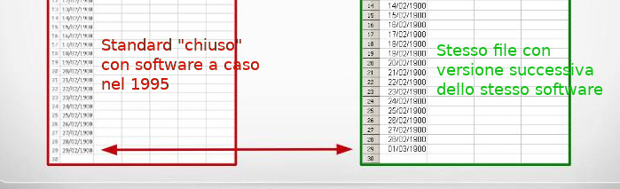
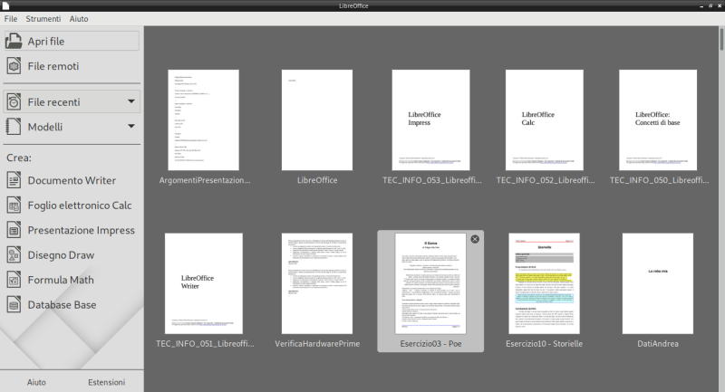
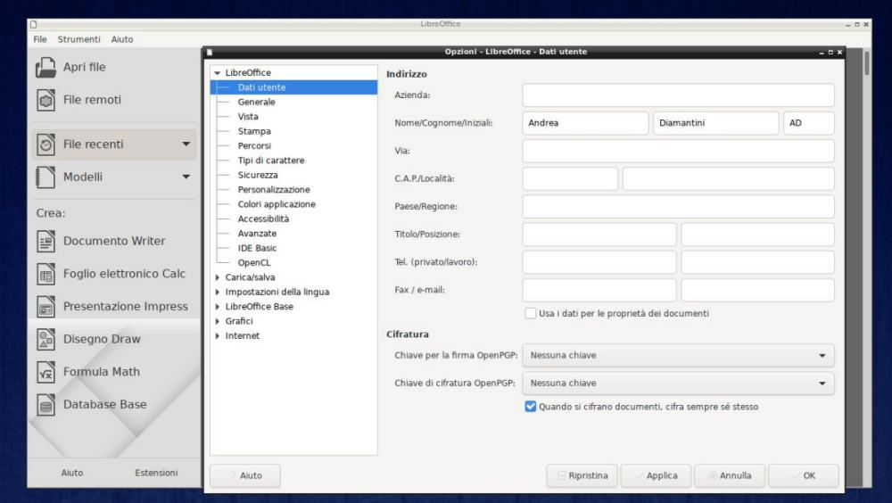
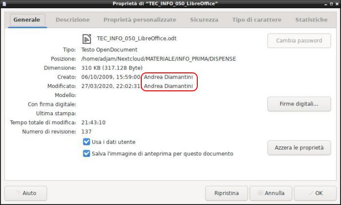

# LibreOffice

LibreOffice è una suite di programmi per l'ufficio: contiene un editor
di documenti, un foglio elettronico, un programma per le presentazioni
multimediali, un database manager, un programma di disegno, uno per le
formule matematiche... insomma, più o meno tutto quello che possa
servire di fare in un ufficio quando si hanno a che fare con dati e
documenti.

Le sue caratteristiche peculiari sono che tutta la suite è un software rilasciato con licenza libera e gratuita
e che supporta attualmente tutti i maggiori sistemi operativi desktop: Windows, Mac, Linux.

Nell'ordine dall'alto a sinistra, le icone di:

- LibreOffice **Writer**, per i documenti
- LibreOffice **Calc**, per i fogli elettronici
- LibreOffice **Impress**, per le presentazioni multimediali
- LibreOffice **Draw**, per il disegno vettoriale
- LibreOffice **Base**, per i database
- LibreOffice **Math**, per le formule matematiche

Dalla versione 6, LibreOffice comprende anche una interfaccia iniziale, 
chiamata semplicemente LibreOffice e che viene identificata dall'icona qui sotto!

## Una pagina di storia

La suite Libreoffice appartiene al grande filone delle suite da ufficio

Questa tipologia di software si sviluppa sin dagli anni '80, con i
mitici WordStar, Lotus 1-2-3, dBase III, Harvard Graphics;
rispettivamente il primo editor di documenti, foglio elettronico,
database manager e software per il disegno vettoriale.

Microsoft capisce da subito l'importanza di sviluppare software di
questo tipo per i propri sistemi operativi e dapprima incoraggia lo
sviluppo della prima suite di programmi da Ufficio, la "Lotus Symphony"
per MS-DOS, poi, alla fine degli anni '80, entra in campo direttamente
con la celebre suite Microsoft Office, per sistemi Windows: 10 anni dopo
Office diventerà la suite per ufficio più utilizzata a livello mondiale
e contribuirà enormemente al successo del sistema operativo Windows.

Negli anni 2000 arrivano le prime suite di produttività opensource ad
intaccare il monopolio Windows/Office: prima OpenOffice e 10 anni dopo,
la neonata suite LibreOffice.

LibreOffice è una suite da ufficio libera e opensource, sviluppata dalla
"**The Document Foundation**" (<https://www.documentfoundation.org/>),
una fondazione no-profit che ***promuove l'utilizzo di software e
formati opensource per la gestione dei dati nei documenti***.

La Document Foundation è sostenuta fin dalla sua fondazione da
importanti aziende del mondo informatico, quali
[Novell](https://it.wikipedia.org/wiki/Novell), [Red Hat](https://it.wikipedia.org/wiki/Red_Hat),
[Canonical](https://it.wikipedia.org/wiki/Canonical) e
[Google](https://it.wikipedia.org/wiki/Google).

Chiudo questa prima pagina con una domanda e una esortazione: perché
secondo loro è così importante utilizzare software e soprattutto formati
opensource per la gestione dei dati nei documenti? Beh... pensaci! In
fin dei conti, è roba tua!

## Formato standard aperto

Spiegare quanto è importante che il formato dei dati sia uno
***standard***, ovvero esista un modello di riferimento a cui attenersi
per la trattazione dei dati e che questo standard sia ***aperto***,
ovvero sia disponibile per sempre per tutti gratuitamente... è veramente
difficile.

Per provare a farlo ho pensato a due immagini che si riferiscono a fatti
reali.

La prima illustra quello che succede quando ci si dimentica di applicare
uno standard:

La seconda illustra quello che può succedere utilizzando standard
chiusi:

Insomma... a me sembra molto chiaro...

LibreOffice utilizza il formato standard e aperto definito "***Open
Document Format***", che viene curato dalla OASIS, una organizzazione
no-profit (in cui partecipa anche Microsoft) per lo sviluppo di uno
standard aperto per i documenti.

L'Open Document Format è stato pubblicato come standard ISO/IEC 26300 --
Open Document Format for Office Applications.

Contiene le seguenti estensioni:

| Tipologia           | Estensione | Descrizione                |
|---------------------|------------|----------------------------|
| Testo               | ODT        | Open Document Text         | 
| Foglio Elettronico  | ODS        | Open Document SpreadSheet  | 
| Presentazione       | ODP        | Open Document Presentation |
| Disegno             | ODG        | Open Document Graphics     |
| Grafico Business    | ODC        | Open Document Chart        |
| Immagine            | ODI        | Open Document Image        |
| Database            | ODB        | Open Document (data)Base   | 
| Formula Matematica  | ODF        | Open Document Formula      |

## Scaricare LibreOffice

LibreOffice è una suite per ufficio gratuita, opensource e
multipiattaforma.

Il suo sito di riferimento è <https://www.libreoffice.org/>.

E' disponibile per l'installazione su sistemi Windows, Mac OS, GNU/Linux
mentre sono attualmente in lavorazione una versione online del prodotto
(gratuitamente installabile su qualunque server web: la propria web
suite) e una versione per Android. Non ci sono piani di supporto per iOS
vista la natura chiusa dell'ecosistema Apple per le app scaricabili
dall'Apple Store.

La pagina di download è <https://www.libreoffice.org/download/>

## Interfaccia comune

Come abbiamo già detto, LibreOffice presenta una interfaccia comune a
tutti i suoi software che permette di accedere facilmente ai vari
programmi della suite e alla cronologia dei file già editati con
qualunque di questi.

Da essa (e da qualunque dei suoi software) è possibile accedere alle
**impostazioni**, che tutti almeno in minima parte dovrebbero
personalizzare!

Quello che ci interessa nel nostro caso è la modifica dei DATI UTENTE:
così facendo tutti i documenti editati da noi, in quel computer con
quell'utente, risulteranno ***firmati*** con quei dati utente inseriti
lì!

Per accedere alle impostazioni, dovete selezionare il menù **STRUMENTI**
e scegliere la voce **OPZIONI**: vi troverete davanti una interfaccia
come questa.

Nella scheda **DATI UTENTE** del gruppo **LIBREOFFICE** inserite i
vostri dati: compilate i campi che volete, ma almeno il nome e il
cognome dovete inserirli!

Da questo momento qualsiasi documento che create sarà
etichettato con i vostri dati!

Per verificare che sia così, in qualsiasi dei programmi LibreOffice, dal
menù FILE scegliete la voce PROPRIETA'.
