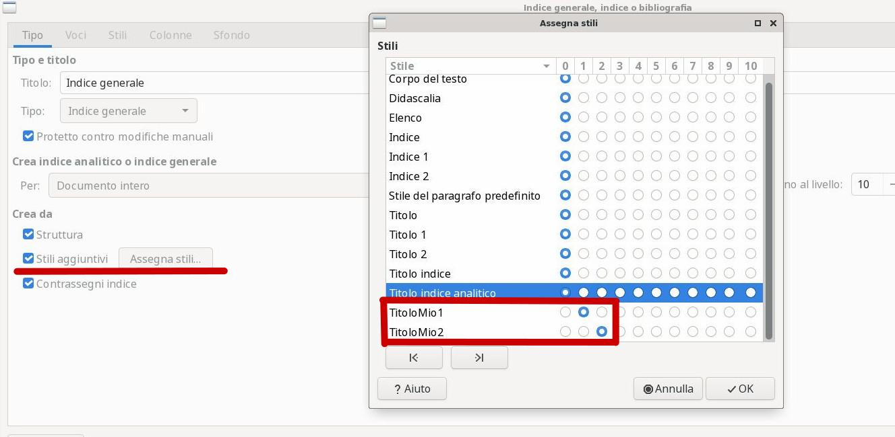

# Libreoffice Writer, un Editor di Documenti

Un editor di documenti è un software per la composizione di testi in
formato elettronico.

Mentre alcuni editor semplici, come il Blocco Note di Windows,
permettono di scrivere solo testo puro, senza alcun tipo di
formattazione, gli editor di documenti permettono di inserire in un
documento, oltre ovviamente al testo, una formattazione completa e
differenziata dello stesso, come di inserire immagini, link e altri
contenuti per arricchire il documento stesso.

Esempi di editor di documenti sono i comunissimi Microsoft Word e
LibreOffice Writer. Noi qui (lo avrete capito) approcciamo un po'
l'editor LibreOffice Writer.

## Operazioni di base

Non starò qui a spiegare come si apre, si crea, si salva e si chiude un
documento: sono operazioni basilari che dovremmo già aver recepito
semplicemente usando qualsiasi tipo di software.

Vorrei solo far notare che Writer, oltre alla possibilità banale di
partire da un documento vuoto, ha la possibilità di:

- creare lettere, fax e altro tramite una procedura guidata,
    
  
  

- partire da un modello di base salvato nel PC,

  

- scaricare un modello gratuito a piacimento dal sito <a target="_blank" href="https://extensions.libreoffice.org/templates">https://extensions.libreoffice.org/templates</a>.

Basta provare ;)

## Stili per il testo

Questo capitolo è il più complicato da spiegare di tutto il corso su
Writer, perché fa notare delle ovvietà che ai più non sono affatto
ovvie. Del resto... chi ha mai studiato come si usa un editor di testo?
Cosa ci vuole... basta aprirlo, scrivere e ricordarsi di salvare alla
fine!

Se vuoi scrivere un titolo bello grosso, come quello **Stili** su in
alto, basta modificarne il font (il tipo di carattere), la dimensione e
metterlo grassetto, giusto?!

**No!**

Per diventare un titolo bisogna modificarne lo stile! Guardate la figura sotto (è orribile, lo so).

Per ottenere un titolo, bisogna modificarne lo stile da "Corpo del
testo" o "Stile predefinito" in "Titolo 1" oppure "Titolo 2"... non
basta modificarne font e dimensione!

Ogni titolo del nostro testo deve avere applicato uno degli stile titolo
disponibili. Così i paragrafi che compongono un capitolo devono essere
tutti di stile "Corpo del testo" oppure uno stile derivato da questi.

!!! note "Il menù per gli stili"

    A un certo punto In Writer è comparso addirittura un **menù dedicato agli stili**
    per permettere agli utenti di gestire al meglio questo importantissimo
    aspetto della formattazione dei documenti.

Esagerando un po', si potrebbe dire che, deciso *quello che si vuole
scrivere*, prima di scriverlo nel documento, bisognerebbe *decidere come
scriverlo*, creando e modificando degli stili adatti al layout che
vogliamo creare. Infine si passa alla digitazione vera e propria del
testo con la semplice *applicazione dello stile appropriato* sul testo
scritto.

Non è semplice, me ne rendo conto. Ma è il modo in cui un utente di buon
livello dovrebbe usare un editor avanzato come Writer o Word per la
stesura di qualsiasi documento non banale.

Come si crea uno stile, si modifica e si applica ad un documento lo
vediamo a lezione.

Gli stili si applicano ad un contesto. E i contesti in un editor di
documenti sono solitamente tre:

1.  Carattere
2.  Paragrafo
3.  Pagina

---

**Stili per carattere**

Come si fa a scrivere una parola in **grassetto** *sottolineato*?
Semplice! Si evidenzia la parola e si clicca su uno dei pulsanti sopra.
Si possono anche sovrapporre più modifiche, ad esempio:

Questo testo viene scritto in font: "Dejavu Sans", dimensione 14,
corsivo e sottolineato. E la parola ~~testo~~ è barrata.

Quando si seleziona una parola o più, lo stile che vi si applica viene
applicato per carattere: ogni carattere della selezione viene modificato
secondo quanto stabilito, ogni carattere non selezionato ***non*** viene
modificato affatto (e quindi mantiene lo stile originale).

E se volessimo avere il controllo di tutti gli stili applicabili ad un
carattere???

Seleziona una parola qualsiasi, poi apri il menù FORMATO e scorri fino a
CARATTERE: lì trovi tutti gli stili che Writer può applicare ad un
carattere.

---

**Stili per paragrafo**

Uno stile viene applicato ad un paragrafo quando tutte le parole che
fanno parte di quel paragrafo ottengono immediatamente lo stile dello
stesso. Qui stiamo dando per scontato che voi sappiate cosa sia un
paragrafo... beh... per Writer un paragrafo è quella porzione di
informazioni (testo, immagini, tabelle, etc...) compresa fra 2 "invio".

Ognuno degli stili predefiniti come "Titolo 1", "Corpo del testo",
etc... sono stili per paragrafo, in questa sua accezione più "estesa".

Se mettete il cursore su un paragrafo, anche senza evidenziare niente, e
poi aprite il menù FORMATO e scorrete fino a PARAGRAFO vedrete che ogni
modifica che fate lì viene applicata immediatamente a TUTTO il
paragrafo!

---

**Stili per pagina**

Ormai avrete capito che per modificare lo stile della pagina basta
andare sul menù FORMATO e selezionare PAGINA. Lì trovate tutti gli stili
che si possono applicare alle pagine del vostro documento, tra cui
l'intestazione (di pagina) e il piè di pagina, che vedremo fra poco.

Ricordate solo che ***ogni modifica allo stile di pagina si applica***
non alla pagina corrente, ma ***a tutte le pagine del documento***!

## Intestazioni e piè di pagina

!!! tip "In Inglese"
    L'intestazione di pagina si chiama ***header***,
    Il piè di pagina si definisce ***footer***. 
    Continuando l'analogia, il corpo della pagina viene chiamato ***body***
  

{style="float:left;margin-right:20px"}

L'intestazione e il piè di pagina sono due aree *separate* del foglio che
si trovano rispettivamente sopra e sotto il corpo centrale della pagina.

Queste due aree appartengono allo stile della pagina e saranno quindi
ripetute costantemente in tutte le pagine del documento.

Per inserirle in un documento, seleziona, dal menù `INSERISCI`, la voce
`INTESTAZIONE E PIE' DI PAGINA`; poi cliccare dentro ognuna di esse per
inserire informazioni che saranno ripetute in tutto il documento.

Queste zone particolari di ogni pagina sono solitamente costellate di 
informazioni generiche be definite (ad esempio: il titolo del documento, l'autore,
il titolo del capitolo, etc...) oppure informazioni che vengono calcolate in tempo reale 
(ad esempio: la data di ultima modifica, il numero della pagina, il totale delle pagine, etc...).

Come si gestiscono tutte queste informazioni automatiche è oggetto del prossimo argmento.

## Comandi di campo

Un comando di campo è una istruzione che impone a Writer di desumere
un'informazione dal documento stesso e di visualizzarla nel punto ove il
comando viene applicato. Per inserirla nel documento (di solito si usano
nelle intestazioni e nei piè di pagina) selezionare il punto prescelto,
poi dal menù `INSERISCI` selezionare `COMANDO DI CAMPO`.

Sono disponibili i seguenti comandi di campo:

- Numero di pagina
- Conteggio pagine
- Data
- Orario
- Titolo
- Primo autore
- Oggetto

## Indice Generale e Indice Analitico

Un **indice generale** è un elenco di tutti i titoli presenti nel nostro
documento, in ordine di apparizione e con il numero di pagina vicino.
Writer crea l'indice inserendo un collegamento in ognuno dei titoli, in
modo tale che "cliccandoci" si possa raggiungere il capitolo
corrispondente.

Un **indice analitico** è un elenco strutturato e ordinato di tutti i
capitoli e gli oggetti (immagini, tabelle, note, etc...) presenti nel
documento.

Una **bibliografia** è un elenco di testi, solitamente con un riferimento o
un link per ognuno, ordinato secondo la volontà dell'autore. Solitamente
la bibliografia di un documento contiene tutte le sue fonti.

> Nella nostra trattazione ci occuperemo semplicemente dell'indice generale. 

Per inserire un indice generale nel nostro documento, dal menù `INSERISCI`, aprire
il sottomenù `INDICE GENERALE E INDICE ANALITICO`, poi selezionare la voce
`INDICE GENERALE, ANALITICO O BIBLIOGRAFIA`.

Dall'interfaccia che appare, selezionare "Indice Generale" e premere invio. 
L'indice generale viene creato automaticamente nella posizione selezionata controllando tutti i titoli presenti nel proprio documento.

!!! warning "Attenzione!"

    Dopo aver creato l'indice generale, questo non si aggiorna automaticamente!!
    
    Dopo aver aggiunto pagine, titoli e/o contenuti devi ritornare sull'indice generale,
    cliccare col tasto destro su di esso e dal menù contestuale selezionare `AGGIORNA`!

    **Ricordatelo!**

Se modifichiamo gli stili dei titoli questi non saranno inseriti
automaticamente nell'indice, ma dovranno essere inseriti
dall'interfaccia grafica selezionandone il nome ed indicando il livello

Dalla finestra di inserimento indice, mettete la spunta su "stili
aggiuntivi", poi dal pulsante "Assegna Stili" andate ad indicare il
livello dello stile che avete creato: 1 se volete che il vostro stile
sia un Titolo1, 2 se volete un Titolo2, etc...

## Inserimento oggetti speciali

In un documento LibreOffice si possono inserire vari tipi di oggetti
speciali: immagini, video, grafici business, formule matematiche, forme
geometriche e oggetti grafici in genere, cornici, fontwork, etc...

Vediamo l'inserimento di alcuni degli oggetti più comuni

### Collegamenti

I collegamenti ipertestuali (i link) si possono assegnare su LibreOffice
ad un qualunque oggetto (un testo, una immagine, etc...). Per inserire
un collegamento, selezionate prima l'oggetto e poi dal menù INSERISCI
scegliete COLLEGAMENTO!

A quel punto dovete solo inserire l'URL di destinazione, ovvero
l'indirizzo del sito che volete aprire quando si clicca l'oggetto!

!!! warning "Attenzione!!!"

    In Writer, click e doppio click selezionano un oggetto! 
    
    Per aprire un collegamento occorre selezionare **CTRL + CLICK**.

### Tabelle

Le tabelle sono una caratteristica peculiare dei documenti con
formattazione: sono molto utili e permettono di organizzare le
informazioni con semplicità.

Writer possiede un menù e una toolbar dedicati espressamente alle
tabelle. Il menù è qui in alto mentre la toolbar si attiva
automaticamente quando si lavora su una tabella...

Tra gli esercizi ce ne sono alcuni espressamente dedicati a lavorare con
le tabelle.

### Immagini

Inserire un'immagine è molto semplice: dal menù INSERISCI, selezionare
IMMAGINE, da qui selezionare il file e premere invio.

Per permettere all'immagine di posizionarsi correttamente secondo il
nostro volere bisogna considerare alcune cose:

| Proprietà                  | Descrizione                                                                                   |
|----------------------------|-----------------------------------------------------------------------------------------------|
| Ancoraggio                 | Stabilisce come l'immagine è legata al testo.                                                 |
| Scorrimento                | Stabilisce in quale modo il testo debba scorrere sull'immagine e se esso possa attraversarla. |
| Allineamento               | Stabilisce l'allineamento dell'immagine rispetto all'ancoraggio.                              |
| Bordi e distanza dal testo | Sono parametri che si possono modificare dalle proprietà dell'immagine.                       |

### Fontwork

I Fontwork sono font speciali tramite le quali inserire un testo
accattivante e molto evidente dei documenti. È una possibilità
utilizzata raramente nei documenti e solitamente riservata ai volantini,
biglietti di auguri, etc...

Per inserire un fontwork con scritto WRITER, dal menù INSERISCI
selezionare FONTWORK; nella finestra che viene aperta selezionare un
fontwork fra quelli mostrati.

Nel fontwork inserito (con la scritta di default FONTWORK) fare doppio
click e procedere alla modifica del testo da visualizzare. ESC per
concludere. Clic sinistro sopra la scritta per attivare i bordi di
ridimensionamento. Tutto qui :)

## Esercizi

Gli esercizi sono... nel PC del prof. Qui trovate elencati solo il
codice dell'esercizio (ad esempio: W01) e gli argomenti su cui esso si
basa.

**Esercizi W0x**

Esercizi con gli stili predefiniti, sommario, intestazione e piè di pagina.

**Esercizi W1x**

Esercizi con gli stili personali (da creare).

**Esercizi W2x**

Esercizi con le immagini

**Esercizi W3x**

Esercizi con le tabelle

**Esercizi W4x**

Esercizi complessi, contenenti tutte le cose studiate, simili alla verifica.
