# LibreOffice Calc, gestire i fogli elettronici

Un foglio elettronico è una tipologia di software da ufficio in grado di
manipolare automaticamente una o più sequenze di dati.

Esso è in grado di operare su essi tutta una serie di operazioni
matematiche, logiche, di confronto e di elaborarne riassunti anche in
forma grafica.

Storicamente si deve al foglio elettronico il passaggio del PC,
nell'immaginario collettivo, da strumento di svago per hobbisti ad uno
degli strumenti di lavoro più efficaci.

Il foglio elettronico più diffuso al mondo è Microsoft Excel, ma fra i
software liberi e opensource il migliore è sicuramente LibreOffice Calc.
Quale sia il migliore fra tutti... è una partita aperta!

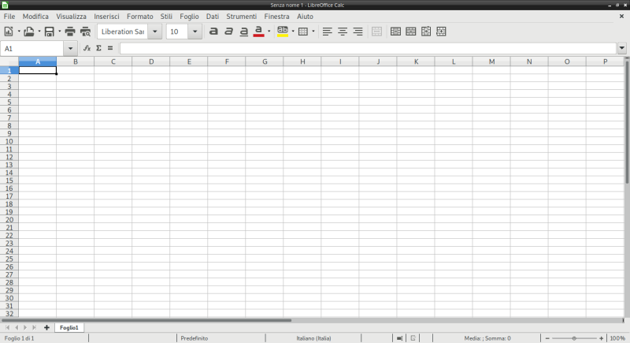

## Gestione Files

LibreOffice Calc è in grado di gestire un numero incredibile di formati
di files, sia in lettura (ovvero per aprire e visualizzare il contenuto
di un foglio elettronico), sia in scrittura (ovvero per salvare un file
secondo un certo formato.

I formati principali che Calc è in grado di gestire sono:

| Formato                     |                               | Descrizione                                                                                      |
|-----------------------------|-------------------------------|--------------------------------------------------------------------------------------------------|
| Il formato .**ods**         | (Open Document SpreadSheet)   | Il formato predefinito di Calc, aperto, standard della Open Document Foundation.                 |
| Il formato **.xlsx**        | (Excel 2007 -- Office 365)    | Il formato predefinito di Excel (dalla versione 2007), standard supportato da Microsoft.         |
| Il formato **.xls**         | (Excel 97 -- 2003)            | Il formato predefinito di Excel prima del 2007, binario (non standard) e proprietario Microsoft. |
| Il formato **.csv**         | (Comma Separated Values)      | Un formato di testo molto semplice molto diffuso, utile per l'esportazione dei valori.           |

## Le caselle del Foglio Elettronico

Ogni file di Calc contiene almeno un foglio elettronico (***sheet***).
Ogni foglio è suddiviso in tante caselle (***cell***). Tante quante?
Esattamente 17.179.869.184! O per meglio dire 234. Infatti le righe,
che sono indicate con un numero crescente, vanno da 1 fino a 1.048.576
(cioè 220), mentre le colonne, che sono indicate con una combinazione
di lettere da A fino ad XFD, sono 16.384 (cioè 214). E il prodotto di 2
potenze con la stessa base è un calcolo molto semplice...

Con tante caselle a disposizione dovremmo capire subito un concetto
fondamentale:

Tutte le caselle di un foglio elettronico dovrebbero contenere solo
informazioni elementari

Ad esempio, se memorizzassimo in esso i nomi dei nostri compagni di
classe (l'elenco della classe) dovremmo inserire in una casella il nome
e in quella adiacente il cognome e organizzare i dati in modo tale che
in una colonna ci siano tutti i nomi e in un'altra tutti i cognomi.

Insomma... un concetto importante sì... difficile no!

L'importanza di questo concetto sta nel fatto che organizzando i dati in
informazioni elementari, essi diventano facilmente elaborabili,
ordinabili, facili da ricercare e modificare.

Insomma, in questo modo il foglio elettronico può lavorare alla massima
potenza!

Ogni casella del foglio elettronico è individuabile incrociando le sue
coordinate

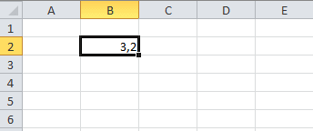

Nello screenshot a fianco, è stata selezionata la **casella B2**, le cui
coordinate sono state ottenute prendendo la colonna (B) e la riga (2) in
cui la casella si trova.

In questa immagine invece, abbiamo una ***selezione rettangolare***,
ottenuta selezionando un gruppo di caselle con il mouse e identificabile
con le coordinate delle caselle:

***"in alto a sx" : "in basso a dx"***

Nel nostro esempio l'area selezionata di individua con le **coordinate B2:D8**.

## Tanti fogli per un solo File

Quando si apre un foglio elettronico vuoto, esso si presenta con un unico Foglio (sheet) presente.

Esso contiene da solo tutte le funzionalità e caratteristiche di cui abbiamo parlato fino ad ora!

Il suo nome di default è "Foglio1".

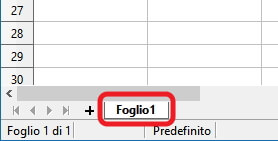

Se fai doppio click sopra al nome, appare una finestra in cui puoi
modificare il nome a tuo piacere.

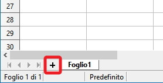

Come si vede dall'immagine è possibile aggiungere altri fogli allo stesso file, semplicemente cliccando sul *+* evidenziato nel disegno!

Chi è curioso dei numeri sappia che ogni file LibreOffice Calc supporta fino a 10.000 fogli!!

Credo possano bastare... per una vita! Non solo per un file...

## Formato dei dati (nelle caselle)

Ogni casella di Calc può gestire dati in un diverso formato, che è
possibile specificare tramite l'opzione "***Formatta celle...***" dal
menù Formato oppure più semplicemente, dal menù contestuale.

I formati disponibili sono i seguenti:

| Formato         | Descrizione                                                                                   | 
|-----------------|-----------------------------------------------------------------------------------------------|
| Numero          | Indica un numero, con o senza virgola.                                                        |
| Percentuale     | Un numero reale tale che 1 corrisponde al 100%                                                | 
| Valuta          | Un numero che indica una quantità monetaria, con accanto il simbolo della moneta selezionata. |
| Data            | Valore per data e ora                                                                         |
| Ora             | Valore per orario                                                                             |
| Scientifico     | Un numero in notazione scientifica                                                            |
| Testo           | Un valore per una stringa di testo                                                            |
| Personalizzato  | Un formato personalizzabile dall'utente                                                       |

Adesso bisogna solo provare!

## Operazioni e Riferimenti

I concetti di operazioni e riferimenti sul foglio elettronico sono un
tipico esempio di qualcosa che non si può imparare *leggendo*, ma si
deve capire *provando* con il foglio elettronico sotto. La spiegazione
che segue è quindi organizzata esattamente come io la farei in
laboratorio: per seguire bene dovete aprire il foglio elettronico e
provare man mano che vado avanti con gli esempi e le spiegazioni.

---

**Esempio 1: moltiplicazioni**

Per prima cosa scrivete un "1" in una casella del foglio elettronico.

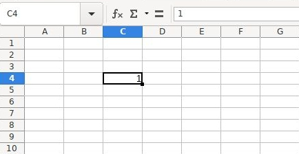

Se rimanete sopra di esso con la selezione

vedete in alto a sinistra il riferimento alla casella selezionata
(**C4**) e in alto a destra della figura, nella **barra della formula**,
il valore **1** ripetuto.

A questo punto avvicinate il mouse alla casella selezionata, precisamente al quadratino evidenziato in
basso a sinistra di essa, fino a che il puntatore non diventa un "mirino" ( + ).

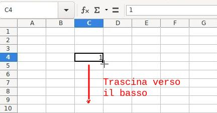

Con il puntatore a mirino, trascinate la casella selezionata, quella con
l'uno, verso il basso.

Come vedete 1 è diventato 2, poi 3 e così via fino a che non ho smesso di scorrere verso il basso.

Mi sono fermato a 10.

Voglio provare a fare la stessa cosa adesso con una parola.

Come vedete, ho scritto "**per**" di fianco al numero 1. Metto il
puntatore vicino al quadratino basso della selezione e con il mirino
tiro verso il basso.

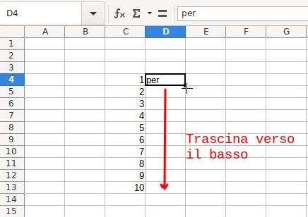

Questa volta le parole sono state semplicemente copiate, senza alcuna modifica o incremento.

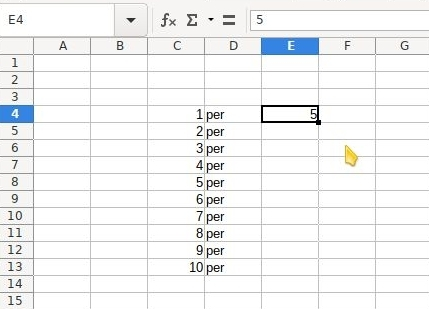

!!! note "Riassumendo:"

    - il trascinamento dei numeri in modalità "mirino" funziona in senso incrementale
    - il trascinamento delle parole in modalità "mirino" copia in maniera identica il contenuto delle caselle.

Adesso proviamo a modificare il comportamento predefinito. Scriviamo un numero di fianco alla scritta "per" (nel mio
esempio 5), posizioniamo il puntatore vicino al quadratino basso della
selezione per la modalità "mirino" e teniamo premuto ++ctrl++ sulla tastiera.

Il trascinamento copierà i numeri come fossero parole

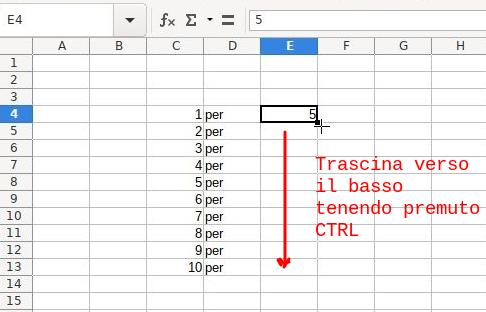

Aggiungiamo una nuova stringa con il solito trascinamento e passiamo alla novità di adesso.

Nella casella del risultato (G4, nel mio esempio) vado a scrivere:

= C4 * E4

Così come lo vedete qui e come appare sulla barra della formula.

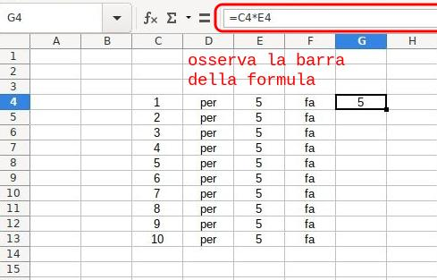

L'uguale all'inizio di una casella induce il foglio elettronico ad eseguire una operazione.

Tramite i riferimenti C4 ed E4 e il simbolo della moltiplicazione ho
indicato cosa dovesse fare. Nella casella trovate il risultato; se
osservate la barra della formula, trovate (appunto) la formula.

Proviamo adesso a trascinare verso il basso la formula in G4 così come abbiamo fatto con gli altri valori.

Incredibilmente il foglio elettronico "aggiorna" la formula con i
***riferimenti relativi*** alla attuale sinistra di ogni colonna!

E le operazioni hanno improvvisamente senso...

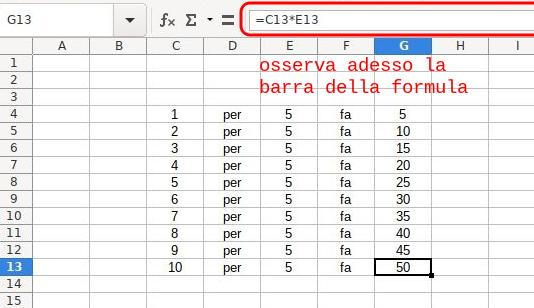

C'è un'altra caratteristica importantissima che ha a che fare con
operazioni e riferimenti e che il foglio elettronico ci offre. Provate a
modificare a mano alcuni dei valori numerici delle prime due colonne e
guardate cosa succede alle caselle con le formule...

---

**Esempio 2: tabelline**

Compresi i concetti del primo esempio, aumentiamo un po' la velocità.

Preparate un nuovo foglio in questo modo:

- colonna di numeri da 1 a 10
- la scritta "tabellina del" sopra
- una casella dove inserire la tabellina da calcolare
- una formula per calcolare la tabellina con una moltiplicazione, pronta per il trascinamento

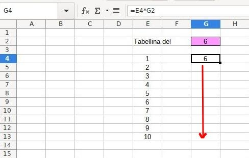

Il trascinamento è ok, ma i risultati... no! Man mano che "abbassiamo" la formula, i numeri della colonna da 1 a 10 vengono
"trasportati" correttamente ma il riferimento al 6 in alto si "sposta" verso il basso.

I riferimenti relativi (quelli dell'esempio 1, ad esempio la casella G2) si muovono durante il trascinamento delle formule.

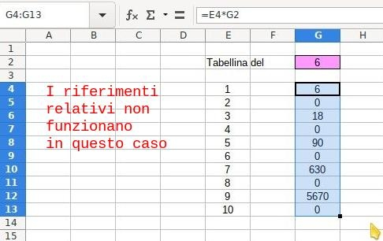

In questo caso occorre un'altra strategia.

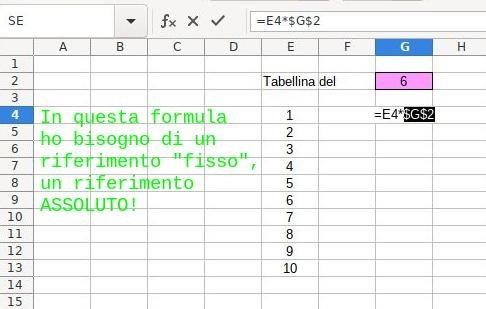

Per avere un riferimento "fisso" devi inserire i "dollari" $ davanti a righe e colonne del riferimento!

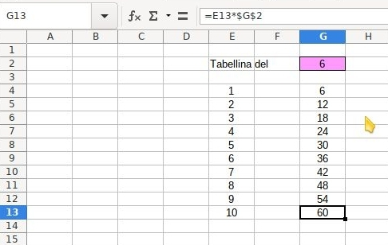

Mi spiego: un **riferimento relativo**, ad esempio **G2** è un
riferimento perché individua una casella, quella che si trova
all'incrocio della colonna G con la riga 2, da cui G2.

Per ottenere un **riferimento assoluto** dobbiamo anteporre i simboli
del dollaro a righe e colonne, quindi G2 diventa **$G$2**.

Un riferimento assoluto individua una casella esattamente come il
riferimento relativo, ma con una importante differenza:

rimane fisso durante i trascinamenti nelle formule!

Ecco allora che trascinando la nuova formula scritta con il riferimento assoluto per la casella G4, otteniamo la tabellina
come la volevamo!

Provate a fare due esperimenti:

1. Osservate la formula che è stata "trascinata" dentro la casella **G13**
2. Provate a modificare il valore nella casella G2

## Grafici

I grafici sono un must per chi utilizza i fogli elettronici perché
permettono di rappresentare i dati in modo chiaro, conciso e velocemente
comprensibile.

Creare un buon grafico per visualizzare la situazione dei dati è
un'arte... noi attualmente ci preoccupiamo solo di capire come poterli
inserire nei nostri fogli.

La cosa più semplice da fare quando si vuole creare un grafico è
**selezionare prima i dati che devono essere rappresentati**. In questo
modo durante la creazione ci si potrà concentrare solo sulla parte...
grafica :)

Partiamo da una tabella qualunque...

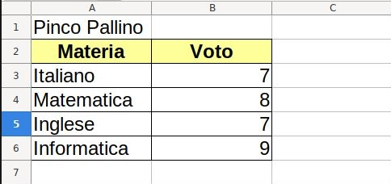

Selezioniamo i dati interessanti, da rendere in un grafico. Nel nostro
caso, volendo rappresentare i voti per materia di Pinco Pallino vado a
selezionare le caselle **A2 : B6**

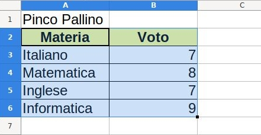

A questo punto andiamo a inserire il grafico con l'azione GRAFICO dal
menù INSERISCI:

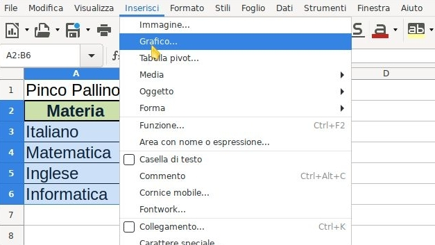

A questo punto si presenta la finestra di selezione grafico. Cosa vi
devo dire? Scegliete quello che vi piace di più...

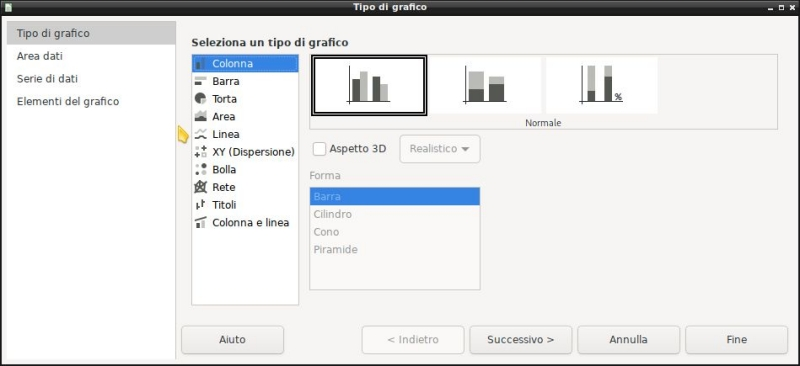

Ci sono 4 step in questa procedura guidata, ma i due complicati, **Area
dati** e **Serie di dati**, sono stati compilati automaticamente grazie
al fatto che avete inserito il grafico con i dati già selezionati!

Passate all'ultima scheda per decidere il titolo e la posizione della
legenda e premete FINE!

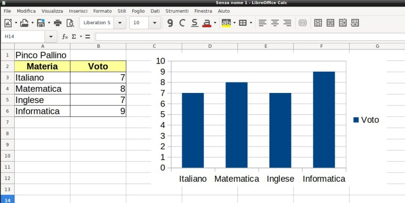

Ecco fatto!

Avete creato il vostro primo grafico con LibreOffice Calc!

Con la pratica impareremo meglio ma così siamo già operativi per gli
esercizi ;)

## Funzioni

LibreOffice Calc fornisce una miriade di funzioni e vi assicuro che ci
toccherà studiarne parecchie! La prima cosa da sapere sulle funzioni è
che sono talmente tante da essere classificate per categoria!

Le categorie di funzioni presenti in LibreOffice Calc sono:

| Categoria          | Descrizione                                                                                                |
|--------------------|------------------------------------------------------------------------------------------------------------|
| Database           | Funzioni che consentono di gestire i dati organizzati in una sola riga per un solo record.                 |
| Data&Orario        | Funzioni per inserire e modificare valori di data e orario.                                                |
| Finanza            | Funzioni di matematica finanziaria                                                                         |
| Informazione       | Funzioni che ritornano informazioni sul foglio elettronico, sul sistema operativo e sul sistema in genere. |
| Logica             | Funzioni per la logica proposizionale.                                                                     |
| Matematica         | Funzioni di matematica: aritmetica, geometria, trigonometria.                                              |
| Matrice            | Funzioni per l'elaborazione dei dati in forma matriciale.                                                  |
| Statistica         | Funzioni statistiche                                                                                       |
| Foglio elettronico | Funzioni generiche per operazioni sul foglio elettronico.                                                  |
| Testo              | Funzioni di manipolazione del testo.                                                                       |
| Add in             | Funzioni aggiuntive disponibili.                                                                           |

Ovviamente noi ne studieremo solo una accurata selezione e neanche per
tutti le categorie disponibili. Però faremo in modo che diventiate
autonomi nello studio di eventuali nuove funzioni che potrebbero
interessarvi in futuro...

Le funzioni si inseriscono selezionando prima di tutto la CASELLA ove si
vuole compiere una operazione e poi selezionando l'apposita pulsante
della barra della formula per l'inserimento guidato di una funzione.

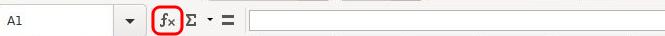

A questo punto:

1. si cerca la funzione per nome con l'apposita casella di ricerca
2. trovata la funzione, si legge la descrizione su di essa che l'interfaccia fornisce
3. si segue la procedura guidata per la creazione della funzione selezionata

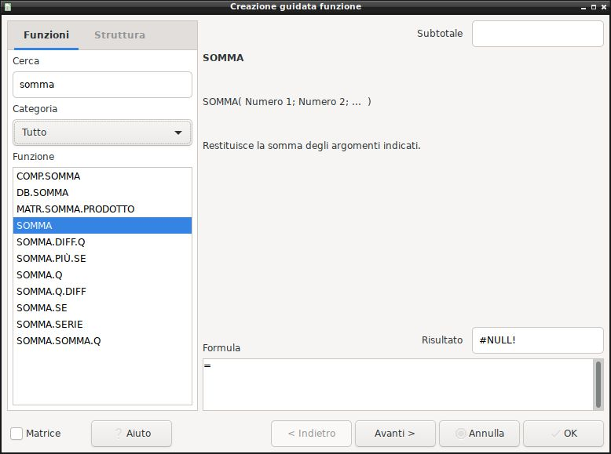

Certo... più o meno è proprio così... e se fosse così facile in un paio
di settimane potremmo fare subito la verifica!

In realtà non è molto complicato, ma è meglio studiare volta per volta
le funzioni che andremo ad utilizzare per non dover ogni volta
ricominciare da zero.

Di certo però non posso presentarvi la procedura guidata per ognuna
delle funzioni che studieremo! Ci mettereste di più a studiare che ad
esercitarvi :)

Le funzioni (e le relative esercitazioni) che andremo a studiare (e ad
affrontare) sono organizzate nella seguente modalità:

- Funzioni Somma, Min, Max
- Funzione Se
- Funzioni conta: conta.se, conta.valori, conta.vuote
- Ordinamento dati
- Importazione da CSV
- Formattazione condizionale
- Formule composte
- Filtri, subtotali, tabelle pivot

