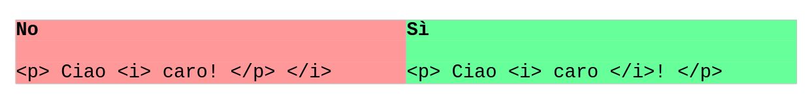

# HTML

HTML Sta per ***Hyper Textual Markup Language***.

Siamo alla versione 5.x

Utilizza documenti di testo semplice, con estensione .html

Si basa sui TAG, che funzionano come le parentesi (apri tag, scrivi, chiudi tag).

Tutta la pagina è racchiusa all'interno del tag HTML, che a sua volta si
suddivide in

- HEAD, il tag contenente le (meta) informazioni sulla pagina
- BODY, il tag contenente la pagina che sarà visualizzata nel browser

La struttura di base di una pagina web (HTML 5.x) è la seguente:


``` html title="Esempio 1"
<!doctype html>
<html lang="it">

<head>
<!-- questo è un commento HTML -->
<title>Il titolo della pagina</title>
</head>

<body>
<!-- qui il codice della pagina che sarà visualizzato nel browser -->
<h1>Ciao, questo è un titolo di capitolo</h1>
<p>Questo è un paragrafo e io sono la tua prima pagina web :)</p>
</body>

</html>
```

Per provare, copiate l'esempio sopra su un editor di testo (ad esempio, il Blocco Note di Windows) e salvate il file con estensione `.html` (ad esempio, con il nome `prova.html`).

Poi, fate doppio click sopra il file...

## Tag HTML: elementi e attributi

Il body rappresenta come uno sfondo bianco sopra il quale galleggiano
una serie di rettangoli, che rappresentano tutti gli elementi della
pagina.

Ogni elemento viene definito tramite un tag, ovvero un "comando" HTML
che specifica un tipo di informazione contenuta nella pagina. Ad esempio
con un tag possiamo indicare un titolo, un testo, un immagine, un video,
etc...

I tag si scrivono nella forma

``` html
<tag> contenuto </tag>
```

oppure semplicemente

``` html
<tag>
```

Nonostante l'HTML sia un linguaggio fortemente tollerante con errori
sintattici di ogni genere, elenchiamo subito le regole auree da
ricordare per il buon funzionamento delle pagine che si scrivono
(soprattutto, perché venga visualizzato esattamente ciò che pensiamo di
avere scritto...):

- i tag che contengono testo hanno il tag di apertura e il tag di chiusura (es: <tag>testo</tag>)
- ripeto: non vi scordate il tag di chiusura!
- I tag si scrivono SEMPRE e SOLO con lettere MINUSCOLE!!!
- I tag si possono "nidificare" con la logica delle parentesi, ovvero l'ordine di chiusura dei tag deve essere rovesciato rispetto all'ordine di apertura (un esempio è meglio di 1000 parole!)





Inoltre i tag possono contenere delle informazioni opzionali, chiamate
***attributi***, che specificano il senso del tag (ad esempio, il tag
che identifica un area cliccabile... dove ti porta quando ci clicchi?
Data una immagine, possiamo definire la sua larghezza? Etc...). Gli
attributi sono sempre inseriti nel tag di apertura e sono sempre
specificati con la sintassi nome="valore".

Ad esempio:

``` html
<tag width="200px"> ciao </tag>

<altrotag saluto="ciao">
```

Vediamo i tag più importanti, aggiungendo per ognuno uno o più esempi da
testare nei propri files (fatelo! O non capirete nulla di quello che
leggete! Invece con 2 minuti di prova per ogni gruppo le cose si
chiariranno in un secondo!).

## Titoli (Headings)

I titoli sono definiti dai tag H1, H2, H3, H4, H5, H6. Il titolo più
importante è il titolo H1, poiché a decrescere in ordine gerarchico.

``` html
<h1> Titolo 1 </h1>

<h2> Titolo 2 </h2>

<h3> Titolo 3 </h3>

<h4> Titolo 4 </h4>

<h5> Titolo 5 </h5>

<h6> Titolo 6 </h6>
```


## Paragrafi

I paragrafi di testo sono contenuti all'interno di un tag P. Prova a
scrivere l'esempio qui sotto e a vedere su una pagina web cosa succede.

``` html
<p>Questo è un paragrafo.</p>

<p>Questo è un altro paragrafo.</p>

<p>Qui scrivi un altro paragrafo con abbastanza testo per riempire la
riga ed andare a capo.</p>
```


## Immagini

Le immagini si inseriscono in una pagina HTML con il tag IMG. Ovviamente
in questo tag esiste un attributo, l'attributo SRC, che permette di
specificare il percorso dell'immagine da visualizzare. Altro attributo
obbligatorio per le immagini è l'attributo ALT, che permette di
specificare un testo alternativo nel caso ad esempio di problemi nella
visualizzazione dell'immagine.

Nell'esempio sotto il file "prova.jpg" si deve trovare nella stessa
cartella del file contenente quel codice.


``` html

```


## Link

I link sono le aree cliccabili delle pagine web. Contengono (ovviamente)
un attributo (href) che permette di specificare la pagina che si vuole
raggiungere quando si seleziona il link.


``` html
<a href="https://www.adjam.org/">la pagina del prof</a>
```


I link hanno inoltre un attributo chiamato TARGET che specifica dove
aprire la pagina indicata nel link.

I possibili valori per esso sono:

- `_self` (default): apre il link nella stessa finestra (o scheda)
- `_blank`: apre il link in una nuova finestra (o scheda)

Esistono anche altri valori per l'attributo, ma si riferiscono ai frame,
che sono una cosa che non voglio impariate :)

Con i link è possibile inoltre creare dei bookmark all'interno della
pagina stessa per portare l'utente in navigazione non solo su una
pagina, ma su un punto esatto di essa. Il riferimento si può creare in
qualsiasi tag con l'attributo ID, il link viene creato dal link alla
pagina più il nome del bookmark.


``` html title="Bookmark"
<h1 id="ip">Il protocollo IP</h1>
```

``` html title="Link (con fragment)"
<a href="#ip">Vai al capitolo sul protocollo IP</a>
```


## Interruzioni di linea

Come andare a capo quando vogliamo noi invece che a seconda di come
viene visualizzata la pagina HTML? Con il tag BR


``` html
<p>In questo<br>esempio ogni<br> due parole<br> vado a <br>
capo!</p>
```


## Linee di interruzione


E se volessimo addirittura interrompere o separare due paragrafi con una
bella linea orizzontale? Basta aggiungere un tag HR!

``` html
<p>Paragrafo SOPRA la linea</p>

<hr> <!-- LINEA ORIZZONTALE -->

<p>Paragrafo SOTTO la linea</p>
```

## Il problema delle poesie in HTML

E se uno dovesse ricopiare una poesia o un testo e mantenere inalterati
spazi e capoversi? Per testo preformattato si usa il tag PRE. Tutto (e
solo) il testo dentro questo tag sarà formattato esattamente come
trascritto. Provare per credere!

``` html
<pre>
Si sta come
d'autunno
sugli alberi
le foglie
</pre>
```


## Formattazione del testo

Esistono tag che servono per la formattazione del testo: grassetto,
corsivo, barrato, apice, pedice sono formattazioni particolari
ottenibili coi seguenti tag:

| TAG     | Descrizione                                                      |
|---------|------------------------------------------------------------------|
|  B      | (bold) testo in grassetto                                        |
|  STRONG | Testo semanticamente Importante (la resa è uguale al grassetto)  |
|  I      | (italic) testo in corsivo                                        |
|  EM     | (emphasized) testo enfatizzato (la resa è uguale al corsivo)     |
|  MARK   | (marked) testo evidenziato                                       |
|  SMALL  | Testo rimpicciolito                                              |
|  DEL    | (deleted) testo cancellato                                       |
|  INS    | (inserted) testo inserito                                        |
|  SUB    | (subscripted) testo a pedice                                     |
|  SUP    | (superscripted) testo ad apice                                   |


Anche qui, provare per capire e verificare

``` html
<b>Testo in grassetto</b> <br>

<strong>Fate i compiti!</strong> <br>

La parola <i>ciao</i> è in corsivo <br>

<em>Sveglia!</em> Disse il docente arrabbiato... <br>

<mark>Testo evidenziato </mark> <br>

Testo <small>piccolo</small> <br>

oops... <del>sbagliato!</del> <br>

Aggiungi <ins>questo</ins>! <br>

Elenco con pedici: a<sub>1</sub>, a<sub>2</sub>,
a<sub>3</sub>... <br>

Potenze (apici): a<sup>2</sup> + b<sup>3</sup> ... <br>
```

che diventa:

<div style="background:#AABBFF">
<b>Testo in grassetto</b> <br>

<strong>Fate i compiti!</strong> <br>

La parola <i>ciao</i> è in corsivo <br>

<em>Sveglia!</em> Disse il docente arrabbiato... <br>

<mark>Testo evidenziato </mark> <br>

Testo <small>piccolo</small> <br>

oops... <del>sbagliato!</del> <br>

Aggiungi <ins>questo</ins>! <br>

Elenco con pedici: a<sub>1</sub>, a<sub>2</sub>,
a<sub>3</sub>... <br>

Potenze (apici): a<sup>2</sup> + b<sup>3</sup> ... <br>
</div>


## Esercizi

In questa sessione di esercizi troveremo pagine da realizzare
contenenti:

- titoli
- paragrafi
- link
- immagini
- formattazioni delle linee (break) e del testo


Crea una directory sul Desktop del tuo PC chiamata "EserciziHTML". Al
suo interno crea un file HTML contenente una pagina HTML vuota e
rinominalo "skeleton.html". Infine crea una cartella denominata
"immagini".

Contenuto del file skeleton.html

``` html title="Skeleton" hl_lines="6"
<!doctype html>

<html lang="it">

<head>
<title>Titolo</title>
</head>

<body>
...
</body>

</html>
```


Quando hai finito gli esercizi potrai esportare la cartella
"EserciziHTML" essendo sicuro di portare via tutto il necessario :)

La cosa più "furba" da fare da qui in poi secondo me è fare copia e
incolla del file "skeleton.html" nel file "EsercizioX.html" e poi
modificare quest'ultimo avente già la struttura di base pronta.

Proviamo!

Per svolgere ognuno dei seguenti esercizi va creato un file (a partire
dal file skeleton.html) che si chiama come l'esercizio stesso.

Ad esempio, il primo esercizio sarà da svolgere nel file
"esercizioA01.html".

---

**Esercizio A01**

Inserire nel body un titolo H1, un paragrafo con testo a piacere e una
immagine dopo il paragrafo. Ridimensionare l'immagine a grandezza fissa.
(width e height). Decidete voi quale in base all'immagine scelta, ma
fate in modo che sia più piccola dell'originale. Il file dell'immagine
va ovviamente salvato nell'apposita cartella delle immagini. Ricordatevi
il testo alternativo!!!

---

**Esercizio A02**

Aggiungere, dopo l'immagine, un titolo H2 chiamato "Link" e sotto un
link al sito del corso dvjlabs.org. State attenti ad aggiungere,
nell'attributo HREF, tutto il link assoluto
"[https://www.dvjlabs.org](https://www.dvjlabs.org/)".

---

**Esercizio A03**

Aggiungere all'immagine un link in modo tale che, al click
sull'immagine, essa venga aperta, in una nuova scheda, alla dimensione
originale.

---

**Esercizio A04**

Aggiungere sotto al titolo dei link alcuni esempi di link a piacere,
separati ognuno da una linea orizzontale

---

**Esercizio A05**

Aggiungere un titolo H2 chiamato HTML. Copiare in un paragrafo P le
prime righe di Wikipedia che parlano di HTML. Fate in modo che occupino
oltre 10 righe.

Aggiungere un titolo H2 chiamato URL. Copiare in un paragrafo P le prime
righe di Wikipedia che parlano di un URL. Come sopra.

---

**Esercizio A06**

Titolo H2 chiamato "La poesia dell'informatico". Comporre una poesia di
4 righe in rima baciata e inserirla sotto il titolo.

---

**Esercizio A07**

Aggiungere i bookmarks (con il tag ID) a tutti i titoli della pagina. In
fondo, aggiungere un nuovo titolo H1 chiamato MAPPA e mettere i link per
andare velocemente a tutte le parti della pagina.

---

**Esercizio A08**

Rileggere tutto il testo scritto e aggiungere l'opportuna formattazione
del testo evidenziando con i tag opportuni i passaggi più importanti.

Aggiungere i commenti HTML opportuni ove necessario per la comprensione.

<br>
<br>

